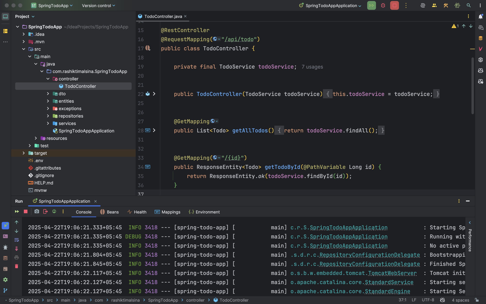
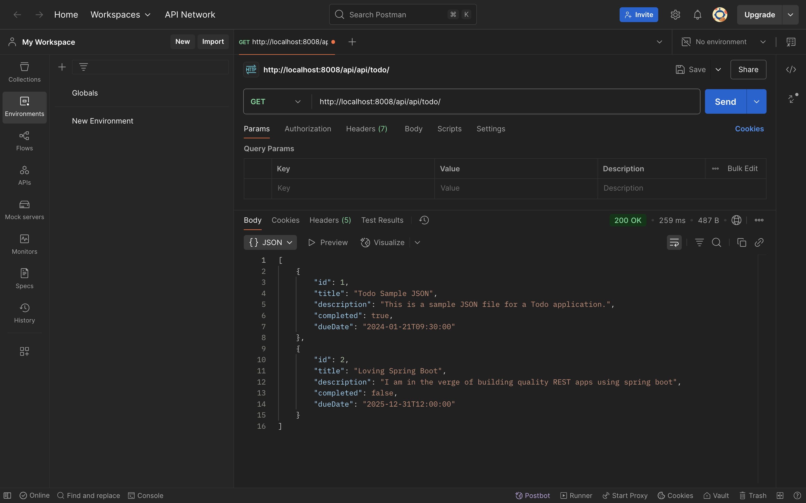
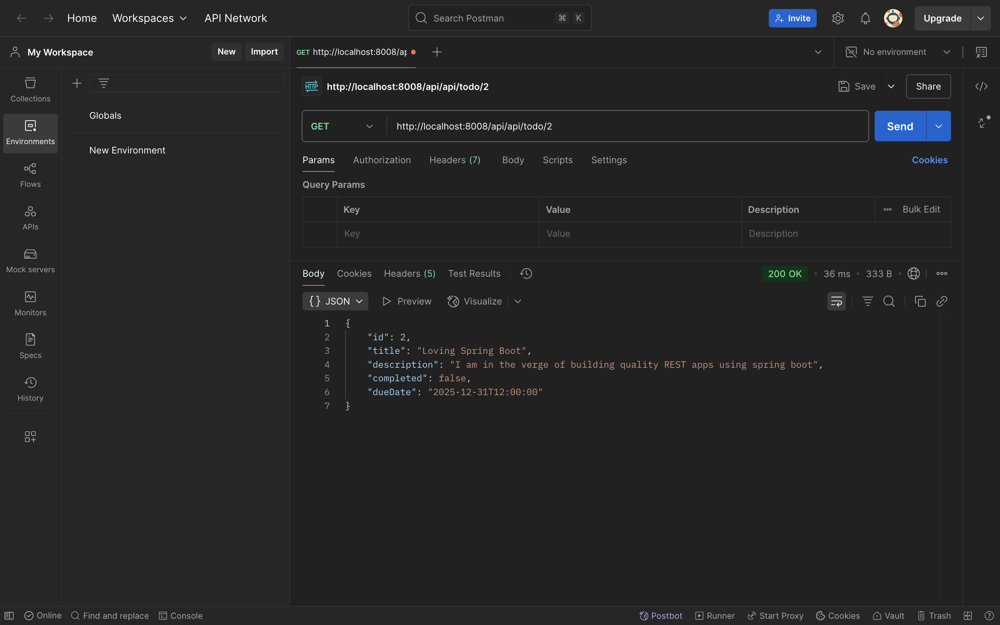
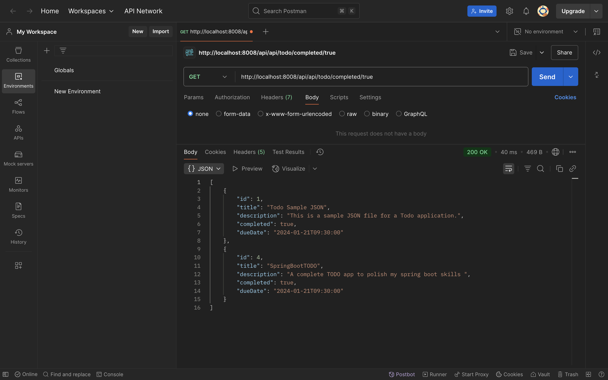
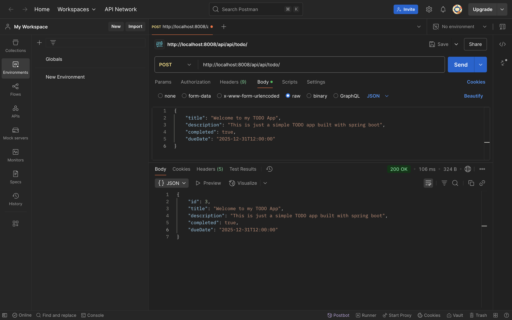
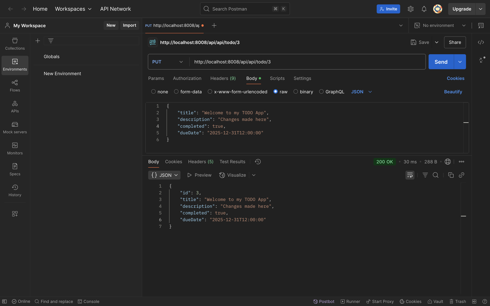
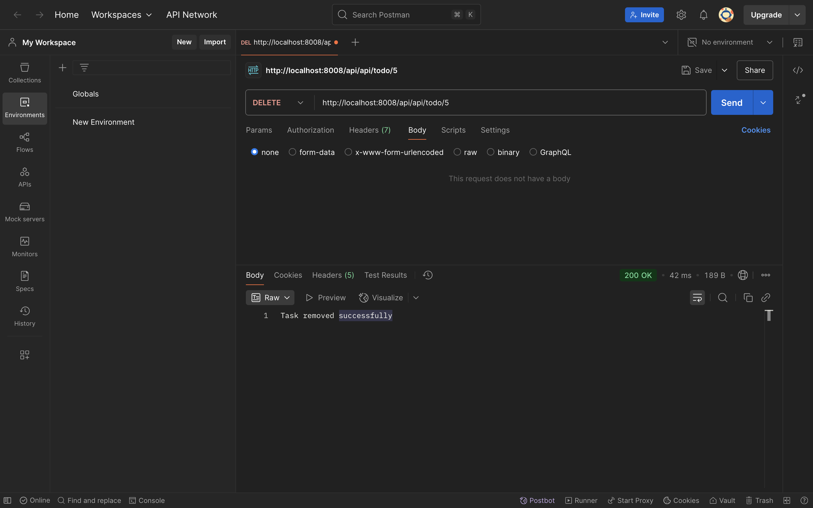
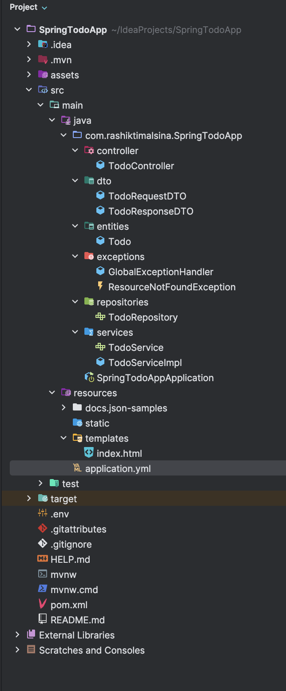

# SpringTodoApp

<p align="center">
  <a href="https://www.java.com/en/">
    
  </a>
  <a href="https://spring.io/projects/spring-boot">
    
  </a>
  <a href="https://www.postgresql.org/">
    
  </a>
  <a href="https://maven.apache.org/">
    
  </a>
  <a href="#">
    
  </a>
  <a href="https://documenter.getpostman.com/">
    
  </a>
  <a href="https://choosealicense.com/licenses/mit/">
    
  </a>
</p>

---

## Table of Contents

- [Project Overview](#project-overview)
- [Tech Stack](#tech-stack)
- [Setup Instructions](#setup-instructions)
- [API Testing](#api-testing)
- [Project Structure](#project-structure)
- [Configurations](#configurations)
- [License](#license)

## Project Overview

**SpringTodoApp** is a simple backend application built with Spring Boot that provides CRUD operations for managing Todo entities. It connects to a PostgreSQL database and exposes RESTful APIs to create, retrieve, update, and delete todo items.

Each Todo entity includes:
- `id` (Long)
- `title` (String)
- `description` (String)
- `completed` (Boolean)

## Project Screenshots

### Application Running Successfully


### Postman API Testing








The project is designed with clean architecture principles and ready for further extension.

## Tech Stack

- **Language**: Java 17
- **Framework**: Spring Boot 3.4.4
- **Database**: PostgreSQL
- **ORM**: Hibernate (JPA)
- **Build Tool**: Maven
- **API Testing**: Postman
- **Environment Variables Management**: dotenv-java
- **Validation**: Spring Boot Starter Validation
- **Logging**: Spring Boot default logging

## Setup Instructions

### Prerequisites
- Java 17+
- Maven
- PostgreSQL Database
- Postman (for API testing)

### Clone the repository
```bash
https://github.com/your-username/SpringTodoApp.git
cd SpringTodoApp
```

### Configure the Database

Make sure PostgreSQL is running and create a database:
```sql
CREATE DATABASE springtodo_db;
```

Set the database password as an environment variable:
```bash
export DB_PASSWORD=your_postgres_password
```

### Build and Run the Application

```bash
mvn clean install
mvn spring-boot:run
```

The application will start on:
```
http://localhost:8008/api
```

## API Testing

All APIs can be manually tested using **Postman**. Key endpoints include:

- **Create Todo**: `POST /api/todos`
- **Get All Todos**: `GET /api/todos`
- **Get Todo by ID**: `GET /api/todos/{id}`
- **Update Todo**: `PUT /api/todos/{id}`
- **Delete Todo**: `DELETE /api/todos/{id}`

Use Postman collections or manual requests to validate functionality.

## Project Structure



## Configurations

Spring Boot configuration is managed via `application.yml`:

```yaml
server:
  port: 8008
  servlet:
    context-path: /api

spring:
  application:
    name: spring-todo-app
  datasource:
    url: jdbc:postgresql://localhost:5432/springtodo_db
    username: postgres
    password: ${DB_PASSWORD}
    driver-class-name: org.postgresql.Driver
  jpa:
    hibernate:
      ddl-auto: update
    show-sql: true
    properties:
      hibernate:
        dialect: org.hibernate.dialect.PostgreSQLDialect
        format_sql: true

logging:
  level:
    root: INFO
    org.springframework.web: INFO
    com.rashiktimalsina.SpringTodoApp: DEBUG
    org.hibernate: INFO

management:
  endpoints:
    web:
      exposure:
        include: health,info,metrics
  endpoint:
    health:
      show-details: always
```

## License

Open-source. Contributions and improvements are welcome.


---

## Author

Rashik Timalsina
